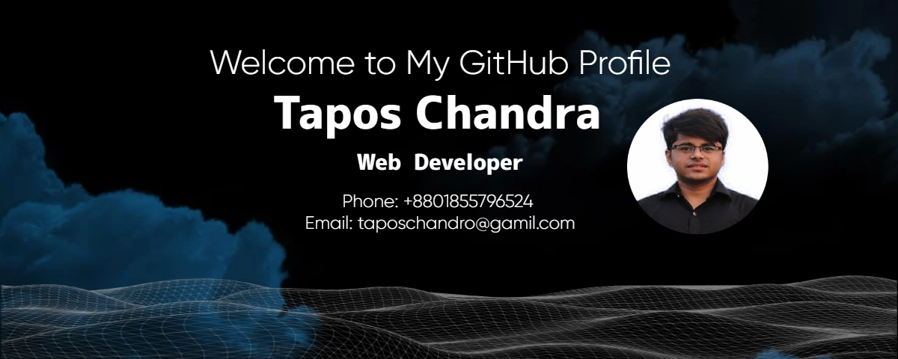

# Hello, I'm Tapos Chandra! 👋

Welcome to my GitHub profile! I am a dedicated and aspiring web developer with a strong focus on creating responsive, efficient, and scalable web applications. I am passionate about learning emerging technologies, solving real-world problems through code, and contributing to the ecosystem.

## About Me

- 🌱 Currently exploring advanced web development frameworks and backend technologies.
- 👯 Eager to collaborate on impactful open-source projects.
- 💬 Feel free to ask me about JavaScript, and web development.
- 📫 Reach out to me at: [taposchandro231@gmail.com.com]

## My Skills 
  

   

  
 

## GitHub Stats

## Top Languages

## Featured Projects

Here are some of my notable projects:

### 🔹 [Mini Missions](https://mini-missions.netlify.app/)
A micro-tasking and earning platform with role-based authentication, task posting, and coin-based payment system.  
**Tech Used:** React, Node.js, MongoDB, Stripe, Firebase, Tailwind CSS

### 🔹 [Crowdfund](https://helpful-mooncake-cfc5b8.netlify.app/)
A crowdfunding application where users can create campaigns and accept contributions.  
**Tech Used:** React, Express, MongoDB, Tailwind CSS

### 🔹 [Blog Website](https://blog-wibsite.netlify.app/)
A feature-rich blog site with user authentication, comment functionality, and blog editing options.  
**Tech Used:** React, Node.js, MongoDB, Firebase, Tailwind CSS

## Let's Connect

- [LinkedIn](https://www.linkedin.com/in/tapos-chandro)

Thanks for visiting my profile! Feel free to explore my repositories and get in touch if you'd like to collaborate or have any questions.
